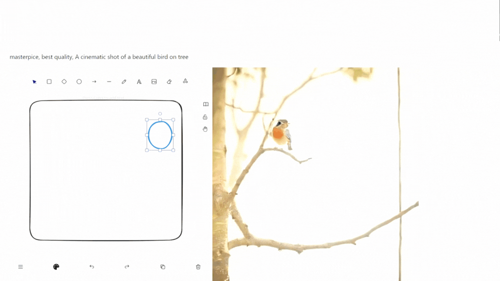
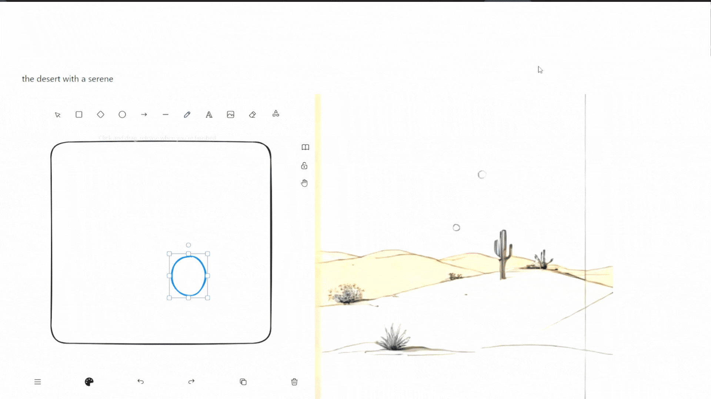

 # some bugs have been fixed.Improved performance. fast result when typing

## LCM Turbo - real-time, Excalidraw WebSockets, Next.js, Fal.ai -






### Getting started

1. Clone the repo

2. Change into the directory and install the dependencies

3. Rename `.env.local.example` to `.env.local` and add your Fal.ai [API Key](https://www.fal.ai/dashboard/keys).

4. Run the app

```sh
npm run dev
```